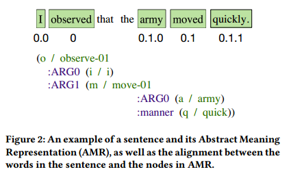
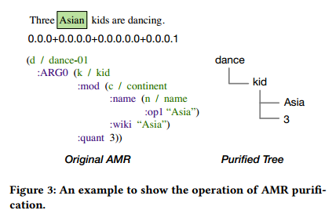
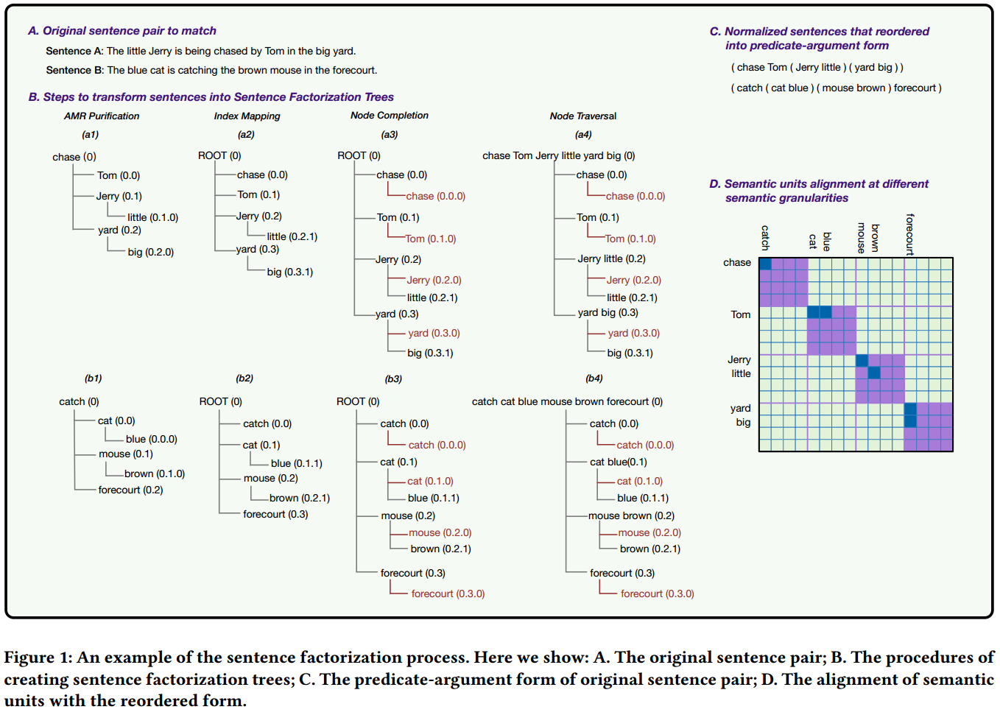
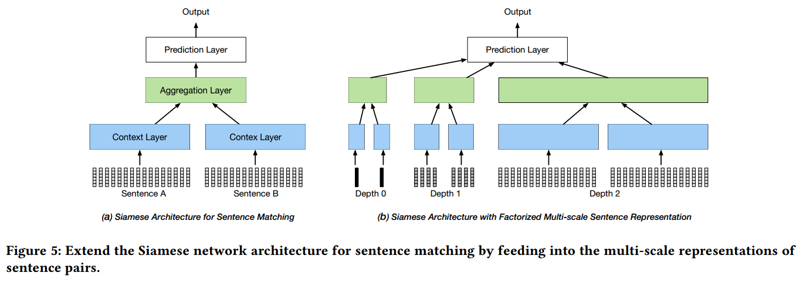
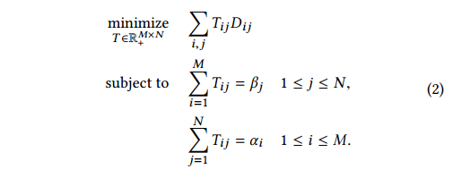
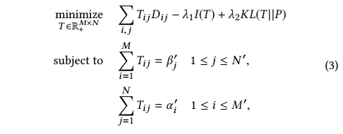

# Matching Natural Language Sentences with Hierarchical Sentence Factorization

## 1 概要
本文主要针对自然语言句子匹配方面，作出的两个贡献：
1. 监督学习方法，提出了句子分解的方法，并提出了与之匹配的多尺度(large-scale)神经网络模型.
2. 无监督方法，提出了改进型的OWMD(Order Word Moving Distance),考虑了句子中的词序信息。

## 2 主要内容

### 2.1 Sentences Factorization
这部分主要是提出一种语句分解的处理方法，将一句话，按照("predicate-argument")的方式，对语句进行分解。提取语句的AMR(Abstract Meaning Representation) parsing. 然后进行进一步处理得到想要的(结构化)分解形式。具体分为以下几个步骤：

    1. AMR parsing and alignment， ( AMR提出初步的分解语义单元。 ) 
    2. AMR Purification. ( 对初步处理的结果进行"纯化", 取出不必要的信息。 )
    3. Index Mapping. ( 对分解的单元进行索引节点映射处理。 )
    4. Node Completion. ( 确保分解树的每个分支都有相同的最大深度，并填充缺失节点。 )
    5. Node Traversal. ( 遍历分解树，得到分解后的每一个语义单元。 )

针对上述5个步骤，分别提出对应的例子，进行解释：

1. 根据已有的AMR算法(本文中采取的是 JAMR Parser)，按照("predicate-argument")的方式，对句子进行分解。

  
  -01. AMR parsing and alignment

2. 根据AMR parsing算法分解的结果，进行纯化处理，提取想要的信息格式。

  
  -02. AMR Purification

3. 在得到初步的分解结果后，剩下的几个步骤，通过句子对(Sentences Pair)的例子解释。

  
  -03. Process_example

如图-03中所述，a, b两个流程对应着两个句子的处理过程。 

#### 2.1.1 AMR Parser
根据已有的AMR算法(本文中采取的是 JAMR Parser)，按照("predicate-argument")的方式，对句子进行分解。

#### 2.1.2 AMR Purification.  
以 a 处理流程为例。在(a1)AMR Purification后, 得到分解后的("predicate-argument")的分解树。 "chase"为分解树的根节点，在原句中，以"chase"为界，又可以分为"chase"的左子树，右子树。然后继续分解。直至每个节点有一个词(token)为止。

#### 2.1.3 Index Mapping  
前一步只是得到了整棵分解树。而我们最终是需要得到每个层次下的分解结果( hierarchical factorization tree ), 也即不同层次(depth)下都能得到整句话的token. 因此需要计算每个词(token)的新索引。 默认初始的根节点为Root(0). 

#### 2.1.4 Node completion.  
确保分解树的每一个分支都有相同的最大深度( maximum depth ), 对于缺失的部分用根节点填充。 如在a3中， 最大深度(depth从0开始计)为 2 ，ROOT(0)--> Jerry --> little; ROOT(0) --> yard --> big;  所以得将所有分支处的根节点向下拓展，使得depth=2的所有节点组成整句话的token. { (chase) (Tom) (Jerry) (little) (yard) (big) } 构成了depth=2时的分解结果。

#### 2.1.5 Node Traversal.  
这一个处理步骤，实现了最终分解树的不同depth下的语义单元的遍历。如：  

    depth=0 { ( chase Tom Jerry little yard big ) }  
    depth=1 { (chase) (Tom) (Jerry little) (yard big) }  
    depth=2 { (chase) (Tom) (Jerry) (little) (yard) (big) }  
每个 "{}" 是不同depth下的分解结果。 每个 "()" 中是对应depth下的每个独立的 语义单元。 把 "()" 囊括的部分当做一个独立的语义单元， 那么 "{}" 就构成了一个词序列。 就可以根据不同depth下的词序列学习模型了。  
对于包含有多个实际词的 "()"进行处理，本文中利用的是实际词的 平均词表正向量(Average word vector).  
当depth=2的时候，对于单个句子就能得到独立的单个词的分解结果。 所以本文中depth只取到2.

再然后根据不同depth分解的结果，进行 large-scale 的神经网络模型的训练学习。 模型架构如下：  

  
-04. Model Architecture

### 2.2 Ordered Word Moving Distance

1. 传统的 Word Moving Distance 方法。  

给定一个句子对 $ S_1 = a_1a_2···aM $ 和 $ S_2 = b_1b_2···b_N $, $ a_1, a_2,...,a_M; b_1, b_2,..., b_N $分别是$ S_1, S_2 $中的词。 对于一个句子中重复的词，采取频次计数，归一化的方式计算权重。
        $$ a_i=\frac{c_i}{\sum_{j=1}^{K}{c_j} } $$

然后根据 pair of sentences 计算一个相似度矩阵$D\in R^{M \times N} $，其中每一个元素 $D_{ij} =|| a_i - b_j ||_2 $为两个词的距离，也可以采用其他距离计算方法。 最后定义一个非负矩阵$ T \in R^{M \times N} $,称之为转移矩阵，$ T_{ij} $用以衡量$a_i$ 向 $b_j$转移的代价。  Word Moving Distance 定义为 $ \sum_{ij}{ T_{ij} D_{ij} }$. $ T $可以通过以下约束优化问题求解。

  
-05. Word Mover's Distance

2. Ordered Word Mover's Distance

传统的 WMD 主要有两个缺陷：1)忽视了句子顺序结构信息(词序信息，语法变种，主动被动语态等); 2)规范化的次向量表征，不能区分出现在同一个句子中的多个位置相同的词。

在前面提出的 Sentences Factorization算法的基础上，利用"predicate-argument"结构对句子进行分解，解决语法变种的问题。然后计算下面约束优化问题：

  
-06. Orederd Word Mover's Distance

